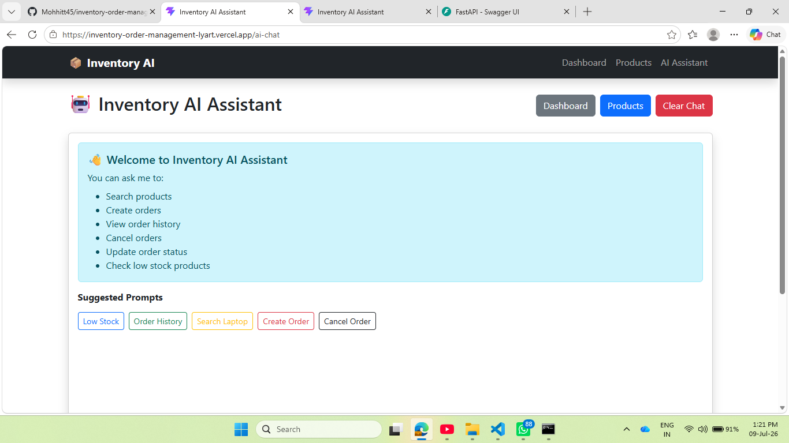
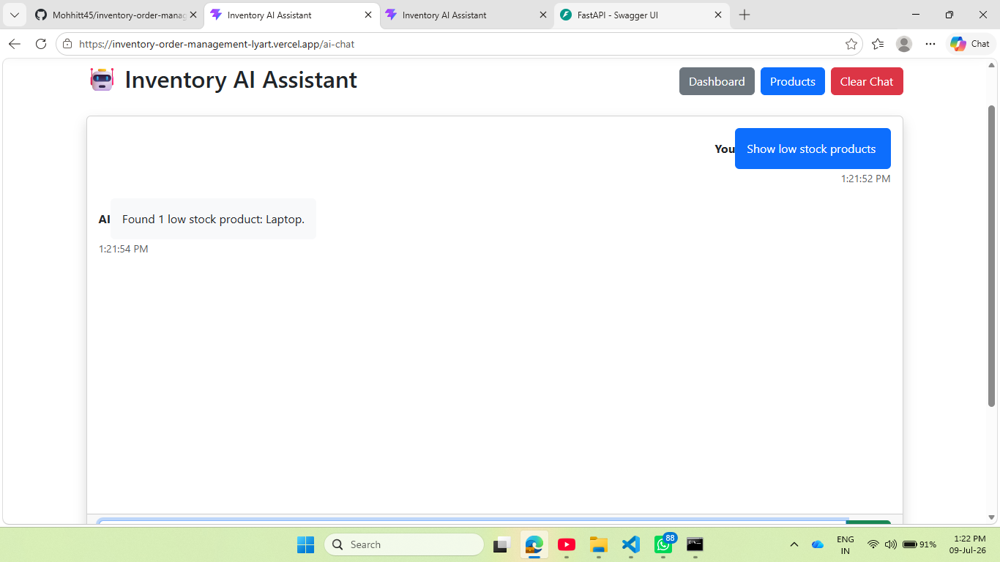
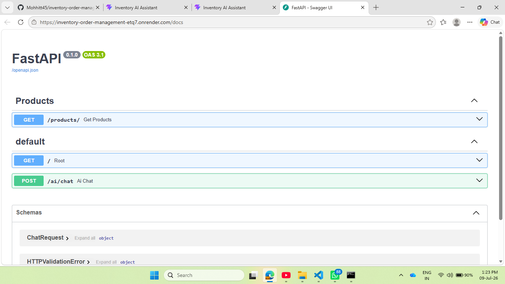
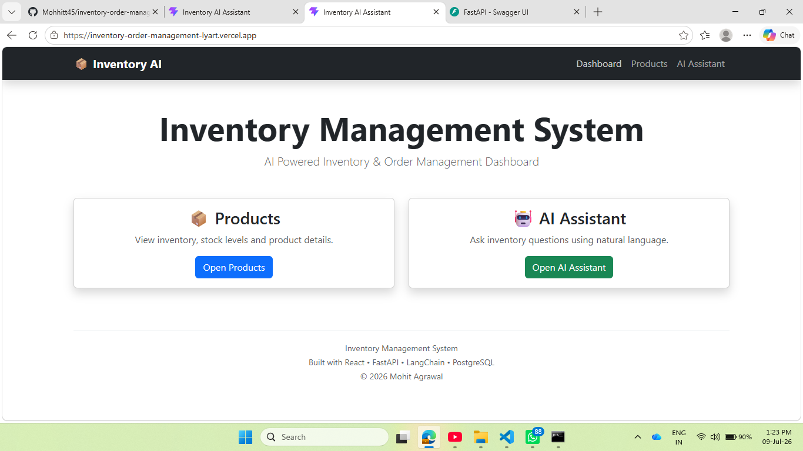

# 🤖 AI Inventory & Order Management System

An AI-powered Inventory and Order Management System that enables users to manage inventory, track orders, and interact with an intelligent AI assistant using natural language queries.

Built using **FastAPI, React, PostgreSQL, LangChain Agents, and Groq LLM**.

The system combines traditional inventory management APIs with an AI agent capable of understanding user requests and executing business operations through tool calling.

---

## 🚀 Live Demo

| Service | Link |
|---|---|
| 🌐 Frontend (React + Vite) | [inventory-order-management-lyart.vercel.app](https://inventory-order-management-lyart.vercel.app/) |
| ⚙️ Backend API (FastAPI) | [inventory-order-management-etq7.onrender.com](https://inventory-order-management-etq7.onrender.com/) |
| 📄 API Documentation (Swagger) | [inventory-order-management-etq7.onrender.com/docs](https://inventory-order-management-etq7.onrender.com/docs) |

---

## ✨ Features

### 📦 Inventory Management
- View all products
- Search products by name and SKU
- Track available stock
- Calculate inventory value
- Detect low-stock products

### 🛒 Order Management
- Create customer orders
- View order history
- Update order status
- Cancel orders
- Track order workflow

### 🤖 AI Inventory Assistant
Users can interact with the system using natural language.

**Example queries:**
- "Show low stock products"
- "Search laptop products"
- "Create order for product ID 5"
- "Show order history"

The AI assistant uses:
- LangChain Agents
- LangGraph workflow
- Groq LLM
- Custom inventory tools

The agent decides which backend tool should be executed based on the user's request.

---

## 🏗️ System Architecture

```
                    User
                     │
                     ▼
             React Frontend
            (Vite + Bootstrap)
                     │
                     ▼
                 REST API
                     │
                     ▼
             FastAPI Backend
                     │
          ┌──────────┴──────────┐
          ▼                     ▼
   PostgreSQL Database    AI Agent Workflow
                                 │
                                 ▼
                         LangChain Agent
                                 │
                                 ▼
                             Groq LLM
```

---

## 🧠 AI Agent Workflow

```
User Query
    │
    ▼
LangGraph Agent
    │
    ▼
Intent Understanding
    │
    ▼
Tool Selection
    │
    ▼
Database Operation
    │
    ▼
Natural Language Response
```

**Available AI tools:**
- Product search
- Low stock detection
- Order creation
- Order history lookup
- Order status update
- Order cancellation

---

## 🛠️ Tech Stack

**Frontend**
- React.js
- Vite
- Bootstrap
- Axios

**Backend**
- Python
- FastAPI
- SQLAlchemy
- Pydantic

**Database**
- PostgreSQL
- Neon Database

**Artificial Intelligence**
- LangChain
- LangGraph
- Groq LLM
- AI Agents
- Tool Calling

**Deployment**
- Vercel (Frontend)
- Render (Backend)

---

## 📂 Project Structure

```
inventory-order-management
│
├── backend
│   ├── app
│   │   ├── ai
│   │   │   ├── agent.py
│   │   │   └── tools.py
│   │   │
│   │   ├── routes
│   │   ├── models.py
│   │   ├── database.py
│   │   └── main.py
│   │
│   └── requirements.txt
│
├── frontend
│   ├── src
│   │   ├── components
│   │   ├── pages
│   │   └── api
│   │
│   └── package.json
│
└── README.md
```

---

## 🔌 API Endpoints

### Products API

**Get All Products**
```
GET /products/
```
Returns all available inventory products.

### AI Assistant API

**Chat with AI Agent**
```
POST /ai/chat
```

**Request Example**
```json
{
  "message": "Show low stock products"
}
```

**Response Example**
```json
{
  "response": "There are 2 low stock products available."
}
```

---

## ⚙️ Local Setup

### Backend Setup

**1. Clone repository**
```bash
git clone https://github.com/Mohhitt45/inventory-order-management.git
```

**2. Navigate to backend**
```bash
cd backend
```

**3. Install dependencies**
```bash
pip install -r requirements.txt
```

**4. Create `.env` file**
```
DATABASE_URL=your_database_url
GROQ_API_KEY=your_groq_api_key
```

**5. Run backend**
```bash
uvicorn app.main:app --reload
```

### Frontend Setup

**1. Navigate to frontend**
```bash
cd frontend
```

**2. Install packages**
```bash
npm install
```

**3. Run application**
```bash
npm run dev
```

---

## 📸 Screenshots

### AI Assistant





### Swagger API Documentation




### Inventory Dashboard




---

## 🔮 Future Improvements

- User authentication and authorization
- Role-based access control
- Advanced analytics dashboard
- Inventory forecasting using ML models
- Automated supplier recommendations
- Docker based deployment
- Cloud monitoring and logging

---

## 👨‍💻 Author

**Mohit Agrawal**
AI Engineer | Data Scientist

GitHub: [@Mohhitt45](https://github.com/Mohhitt45)